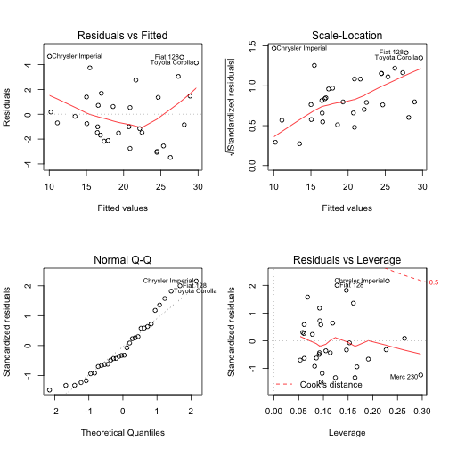

<style>
.footer {
    color: blue;
    background: #FFFF33;
    position: fixed;
    top: 90%;
    text-align:center;
    width:100%;
}
</style>

Predict Miles Per Gallon
========================================================
author: Santhosh Ladalla
date: 10/24/2015
css: bootstrap.css

Description
========================================================
class: illustration


This App is created to predict miles per gallon based on weight,trasmission and qsec (1/4 mile time).The steps to the use the App are below

* Select Trasmission (Manual vs Automatic)
* Select the weight (lb/1000 units)
* Select the Qsec (time for quarter mile)
* Click Submit
* View the Selected Values and Predicted values in the main pane.

Data set 
========================================================
mtcars dataset is used to build a linear regression model using miles per gallon,weight,trasmission and qsec.There are others features that are available in the data set but after more analysis the above 3 variable provide good prediction power of the miles per gallon.


```r
summary(mtcars[,c(6,7,9)])
```

```
       wt             qsec             am        
 Min.   :1.513   Min.   :14.50   Min.   :0.0000  
 1st Qu.:2.581   1st Qu.:16.89   1st Qu.:0.0000  
 Median :3.325   Median :17.71   Median :0.0000  
 Mean   :3.217   Mean   :17.85   Mean   :0.4062  
 3rd Qu.:3.610   3rd Qu.:18.90   3rd Qu.:1.0000  
 Max.   :5.424   Max.   :22.90   Max.   :1.0000  
```

Regression model Plot
========================================================


```r
fit <- lm(mpg ~ wt + qsec + am,data=mtcars)
layout(matrix(c(1,2,3,4),2,2))
plot(fit)
plot(fit)
```

 

Conclusion and Enhancements
========================================================
* This App  predicts the mileage per gallon accurately 
* This App can be enhanced with more data  and adding more features to get best results
* This is Fun !!


